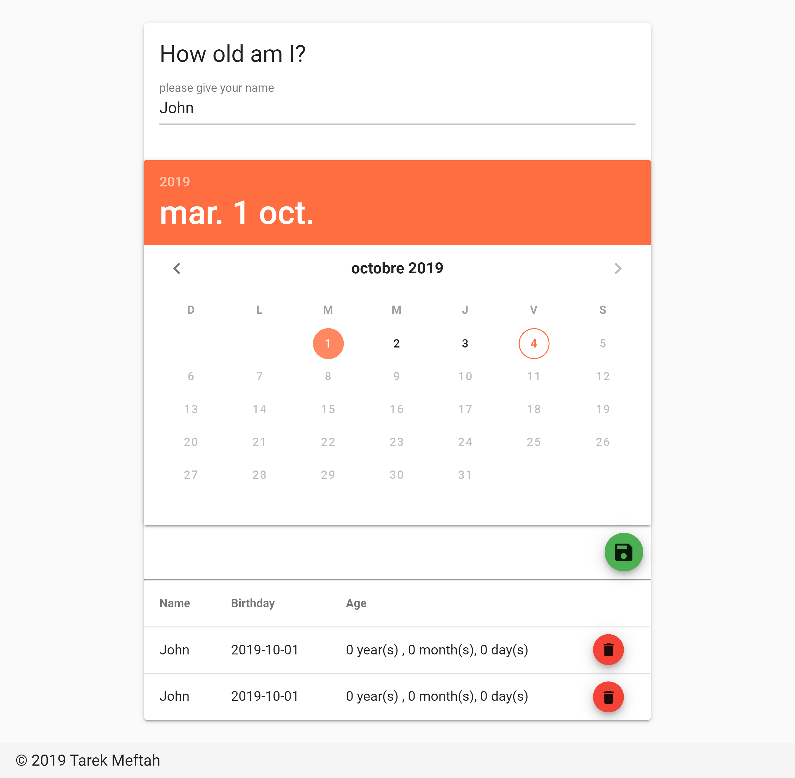

# Age Calculator 
[](https://app.netlify.com/sites/agecalc/deploys)

Age Calculator with Nuxt.js vuetify 

<p align="center">
  
</p>


## Build Setup

``` bash
# install dependencies
$ npm run install

# serve with hot reload at localhost:3000
$ npm run dev

# build for production and launch server
$ npm run build
$ npm run start

# generate static project
$ npm run generate
```

For detailed explanation on how things work, check out [Nuxt.js docs](https://nuxtjs.org).
